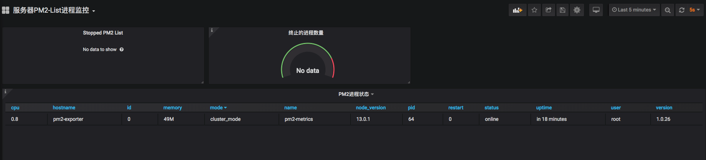

# Prometheus Docker-Compose

### Command

```
#启动compose：
npm run start:local
#停止compose：
npm run stop:local

```

### prometheus web ui

[web](http://localhost:9090/)


### Grafana web ui

[web](http://localhost:3000)

#### Grafana datasource
```
http://promteheus:9090/
```

### Show





## 参考资料
[prometheus.io](https://prometheus.io/docs/introduction/overview/)
[prometheus-book](https://yunlzheng.gitbook.io/prometheus-book/)
