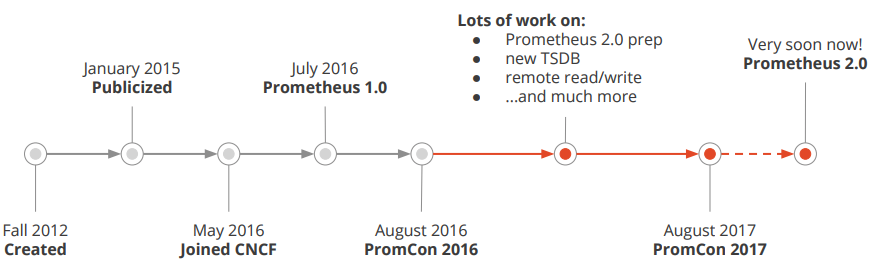
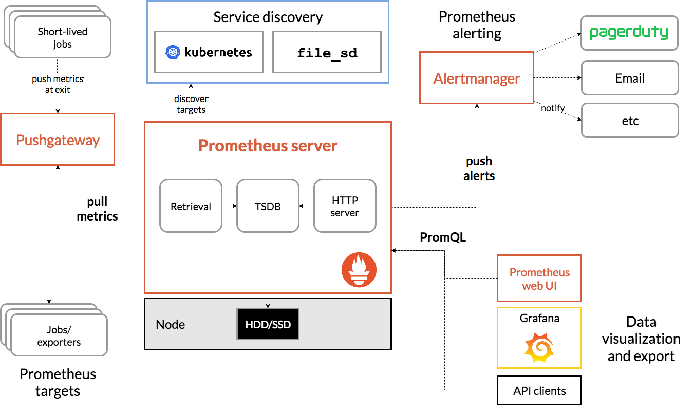

[TOC]

# Prometheus 介绍

## 什么是普罗米修斯？

Prometheus是最初在SoundCloud上构建的开源系统监视和警报工具包 。自2012年成立以来，许多公司和组织都采用了Prometheus，该项目拥有非常活跃的开发人员和用户社区。现在，它是一个独立的开源项目，并且独立于任何公司进行维护。为了强调这一点并阐明项目的治理结构，Prometheus 于2016年加入了 Cloud Native Computing Foundation，这是继Kubernetes之后的第二个托管项目

### 特征(Features)
普罗米修斯的主要特点是：
- 一个多维数据模型，其中包含通过度量标准名称和键/值对标识的时间序列数据
- PromQL，一种灵活的查询语言
- 不依赖分布式存储；单服务器节点是自治的
- 通过HTTP上的拉模型进行收集时间序列 (PULL)
- 通过中间网关支持推送时间序列 (PUSH)
- 通过服务发现或静态配置发现目标
- 多种图形和仪表板支持模式

### 组件(Components)
Prometheus生态系统包含多个组件，其中许多是可选的：
- Prometheus主服务器，它会刮取并存储时间序列数据
- 客户端库，用于检测应用程序代码
- 一个支持短期工作的推送网关
- 诸如HAProxy，StatsD，Graphite等服务的专用出口商
- 一个alertmanager处理警报
- 各种支持工具

### 结构(Architecture)
下图说明了Prometheus的体系结构及其某些生态系统组件

### 什么时候合适？

Prometheus非常适合记录任何纯数字时间序列。它既适合以机器为中心的监视，也适合监视高度动态的面向服务的体系结构。在微服务世界中，它对多维数据收集和查询的支持是一种特别的优势。

Prometheus的设计旨在提高可靠性，使其成为中断期间要使用的系统，从而使您能够快速诊断问题。每个Prometheus服务器都是独立的，而不依赖于网络存储或其他远程服务。当基础结构的其他部分损坏时，您可以依靠它，而无需建立广泛的基础结构来使用它。

### 什么时候不适合？

普罗米修斯重视可靠性。即使在故障情况下，您也始终可以查看有关系统的可用统计信息。如果您需要100％的准确性（例如按请求计费），则Prometheus并不是一个不错的选择，因为所收集的数据可能不会足够详细和完整。在这种情况下，最好使用其他系统来收集和分析计费数据，并使用Prometheus进行其余的监视。

## 监控的目的

通过建立完善的监控体系，从而达到以下目的：

- 长期趋势分析：通过对监控样本数据的持续收集和统计，对监控指标进行长期趋势分析。例如，通过对磁盘空间增长率的判断，我们可以提前预测在未来什么时间节点上需要对资源进行扩容。
- 对照分析：两个版本的系统运行资源使用情况的差异如何？在不同容量情况下系统的并发和负载变化如何？通过监控能够方便的对系统进行跟踪和比较。
- 告警：当系统出现或者即将出现故障时，监控系统需要迅速反应并通知管理员，从而能够对问题进行快速的处理或者提前预防问题的发生，避免出现对业务的影响。
- 故障分析与定位：当问题发生后，需要对问题进行调查和处理。通过对不同监控监控以及历史数据的分析，能够找到并解决根源问题。
- 数据可视化：通过可视化仪表盘能够直接获取系统的运行状态、资源使用情况、以及服务运行状态等直观的信息。