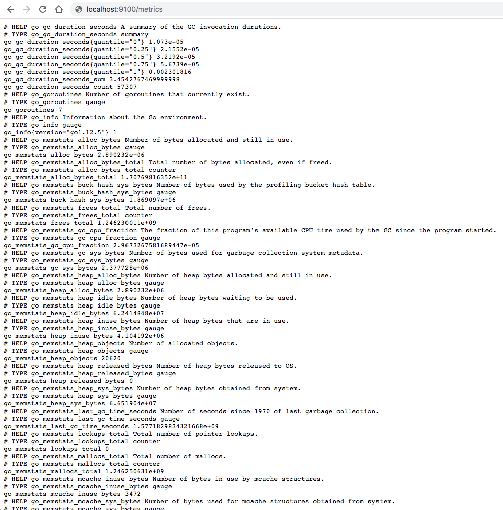
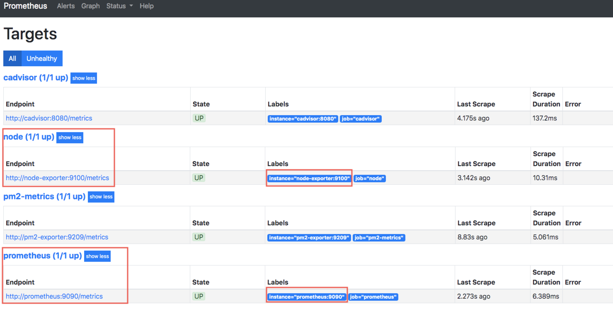
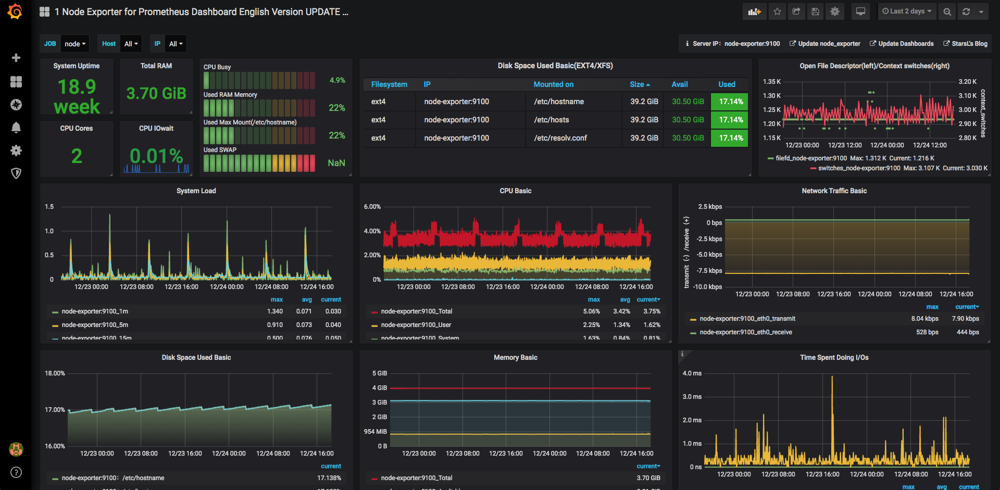

[TOC]


# Node_Exporter

在Prometheus的架构设计中，Prometheus Server并不直接服务监控特定的目标，其主要任务负责数据的收集，存储并且对外提供数据查询支持。因此为了能够能够监控到某些东西，如主机的CPU使用率，我们需要使用到Exporter。Prometheus周期性的从Exporter暴露的HTTP服务地址（通常是/metrics）拉取监控样本数据

## 主机监控指标




每一个监控指标之前都会有一段类似于如下形式的信息：

```
# HELP node_cpu_seconds_total Seconds the cpus spent in each mode.
# TYPE node_cpu_seconds_total counter
node_cpu_seconds_total{cpu="0",mode="idle"} 1.120211867e+07
# HELP node_load1 1m load average.
# TYPE node_load1 gauge
node_load1 0.01
```

其中HELP用于解释当前指标的含义，TYPE则说明当前指标的数据类型。在上面的例子中

- node_cpu的注释表明当前指标是cpu0上idle进程占用CPU的总时间，CPU占用时间是一个只增不减的度量指标，从类型中也可以看出node_cpu的数据类型是计数器(counter)，与该指标的实际含义一致。

- node_load1该指标反映了当前主机在最近一分钟以内的负载情况，系统的负载情况会随系统资源的使用而变化，因此node_load1反映的是当前状态，数据可能增加也可能减少，从注释中可以看出当前指标类型为仪表盘(gauge)，与指标反映的实际含义一致。

除了这些以外，在当前页面中根据物理主机系统的不同，你还可能看到如下监控指标：

- node_boot_time：系统启动时间
- node_cpu：系统CPU使用量
- node*disk**：磁盘IO
- node*filesystem**：文件系统用量
- node_load1：系统负载
- node*memeory**：内存使用量
- node*network**：网络带宽
- node_time：当前系统时间
- go_*：node exporter中go相关指标
- process_*：node exporter自身进程相关运行指标

## 从Node Exporter收集监控数据

为了能够让Prometheus Server能够从当前node exporter获取到监控数据，这里需要修改Prometheus配置文件。编辑prometheus.yml并在scrape_configs节点下添加以下内容:

```xml
scrape_configs:
  - job_name: 'prometheus'
    static_configs:
      - targets: ['localhost:9090']
  # 采集node exporter监控数据
  - job_name: 'node'
    static_configs:
      - targets: ['localhost:9100']
```

### Prometheus Targets 



### Grafana Node Exporter

[Grafana node exporter dashboard template](https://grafana.com/grafana/dashboards/11074)



