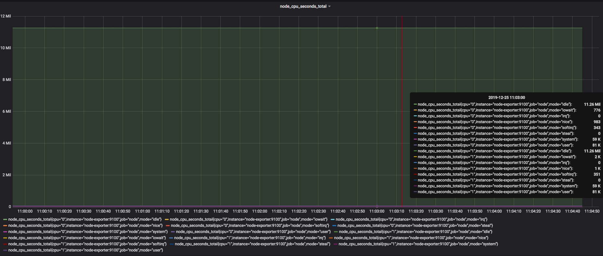
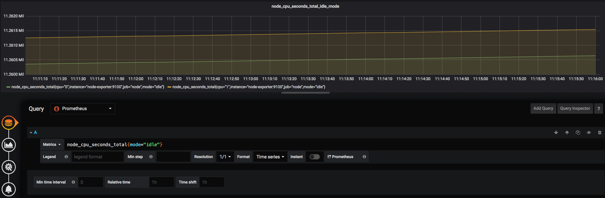
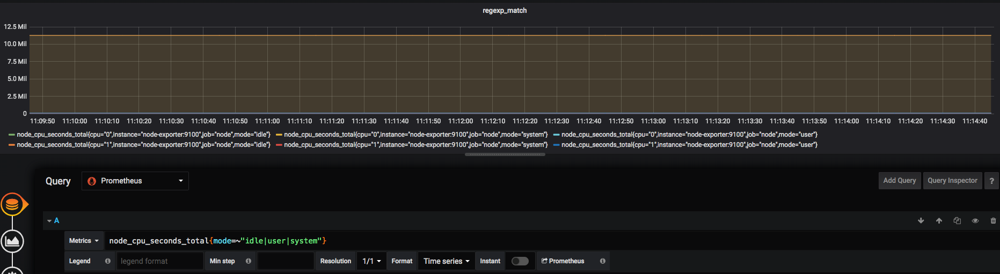
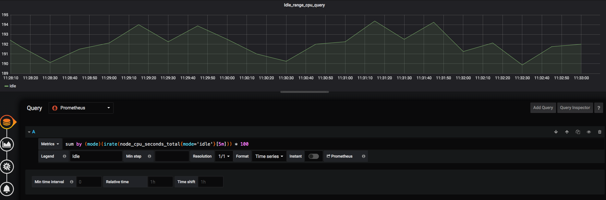
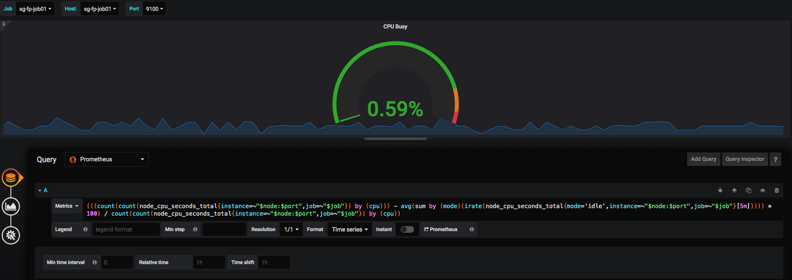

[TOC]


# PromQL

Prometheus通过指标名称（metrics name）以及对应的一组标签（labelset）唯一定义一条时间序列。指标名称反映了监控样本的基本标识，而**label**则在这个基本特征上为采集到的数据**提供了多种特征维度**。用户可以基于这些特征维度过滤，聚合，统计从而产生新的计算后的一条时间序列。

PromQL是Prometheus内置的数据查询语言，其提供对时间序列数据丰富的查询，聚合以及逻辑运算能力的支持。并且被广泛应用在Prometheus的日常应用当中，包括对数据查询、可视化、告警处理当中。

## 查询时间序列

### 全局模式

我们直接使用监控指标名称查询时，可以查询该指标下的所有时间序列。如：

```
node_cpu_seconds_total
```

等同于

```
node_cpu_seconds_total{}
```

该表达式会返回指标名称为 **node_cpu_seconds_total**的所有时间序列:

```
node_cpu_seconds_total{cpu="0",instance="node-exporter:9100",job="node",mode="idle"}
node_cpu_seconds_total{cpu="0",instance="node-exporter:9100",job="node",mode="iowait"}
node_cpu_seconds_total{cpu="0",instance="node-exporter:9100",job="node",mode="irq"}
node_cpu_seconds_total{cpu="0",instance="node-exporter:9100",job="node",mode="nice"}
node_cpu_seconds_total{cpu="0",instance="node-exporter:9100",job="node",mode="softirq"}
node_cpu_seconds_total{cpu="0",instance="node-exporter:9100",job="node",mode="steal"}
node_cpu_seconds_total{cpu="0",instance="node-exporter:9100",job="node",mode="system"}
node_cpu_seconds_total{cpu="0",instance="node-exporter:9100",job="node",mode="user"}
node_cpu_seconds_total{cpu="1",instance="node-exporter:9100",job="node",mode="idle"}
node_cpu_seconds_total{cpu="1",instance="node-exporter:9100",job="node",mode="iowait"}
node_cpu_seconds_total{cpu="1",instance="node-exporter:9100",job="node",mode="irq"}
node_cpu_seconds_total{cpu="1",instance="node-exporter:9100",job="node",mode="nice"}
node_cpu_seconds_total{cpu="1",instance="node-exporter:9100",job="node",mode="softirq"}
node_cpu_seconds_total{cpu="1",instance="node-exporter:9100",job="node",mode="steal"}
node_cpu_seconds_total{cpu="1",instance="node-exporter:9100",job="node",mode="system"}
node_cpu_seconds_total{cpu="1",instance="node-exporter:9100",job="node",mode="user"}
```

图表如下：



### 匹配模式

PromQL还支持用户根据时间序列的标签匹配模式来对时间序列进行过滤，目前主要支持两种匹配模式：完全匹配和正则匹配。

#### 完全匹配

```
node_cpu_seconds_total{mode="idle"}
```

结果如图:



#### 正则匹配

- 使用`label=~regx`表示选择那些标签符合正则表达式定义的时间序列；
- 反之使用`label!~regx`进行排除；
- 多个表达式之间使用`|`进行分离

```
node_cpu_seconds_total{mode=~"idle|user|system"}
```

结果如图:




### 范围查询

直接通过类似于PromQL表达式node_cpu_seconds_total查询时间序列时，返回值中只会包含该时间序列中的最新的一个样本值，这样的返回结果我们称之为***瞬时向量***。而相应的这样的表达式称之为**瞬时向量表达式**。

而如果我们想过去一段时间范围内的样本数据时，我们则需要使用**区间向量表达式**。区间向量表达式和瞬时向量表达式之间的**差异**在于在区间向量表达式中我们需要定义时间选择的范围，时间范围通过时间范围选择器`[]`进行定义。例如，通过以下表达式可以选择最近5分钟内的所有样本数据：

```
sum by (mode)(irate(node_cpu_seconds_total{mode='idle'}[5m])) * 100
```

该表达式将会返回查询到的时间序列中最近5分钟的所有样本数据

结果入下图：



除了使用m表示分钟以外，PromQL的时间范围选择器支持其它时间单位：

- s - 秒
- m - 分钟
- h - 小时
- d - 天
- w - 周
- y - 年


### 聚合查询

```
(((count(count(node_cpu_seconds_total{instance=~"$node:$port",job=~"$job"}) by (cpu))) - avg(sum by (mode)(irate(node_cpu_seconds_total{mode='idle',instance=~"$node:$port",job=~"$job"}[5m])))) * 100) / count(count(node_cpu_seconds_total{instance=~"$node:$port",job=~"$job"}) by (cpu))
```

上面的表达式是查询CPU使用率的聚合查询表达式，

结果入下图：



Prometheus还提供了下列内置的聚合操作符，这些操作符作用域瞬时向量。可以将瞬时表达式返回的样本数据进行聚合，形成一个新的时间序列。

- `sum` (求和)
- `min` (最小值)
- `max` (最大值)
- `avg` (平均值)
- `stddev` (标准差)
- `stdvar` (标准差异)
- `count` (计数)
- `count_values` (对value进行计数)
- `bottomk` (后n条时序)
- `topk` (前n条时序)
- `quantile` (分布统计)

时间有限，在这里就不一一展示了